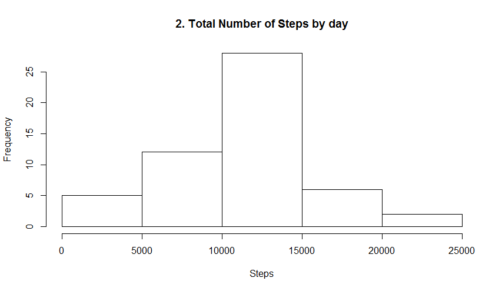
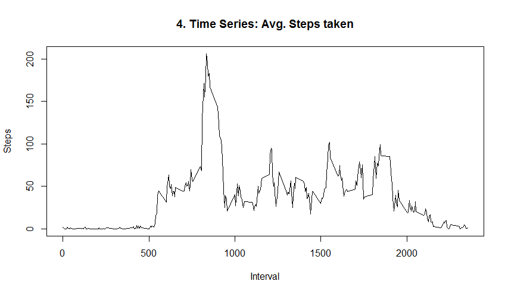
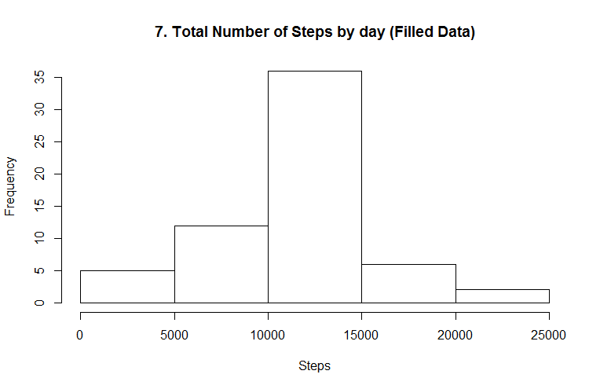
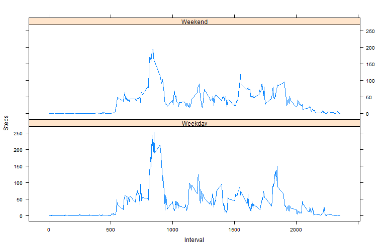

#Introduction

It is now possible to collect a large amount of data about personal movement using activity monitoring devices such as a Fitbit, Nike Fuelband, or Jawbone Up. These type of devices are part of the "quantified self" movement - a group of enthusiasts who take measurements about themselves regularly to improve their health, to find patterns in their behavior, or because they are tech geeks. But these data remain under-utilized both because the raw data are hard to obtain and there is a lack of statistical methods and software for processing and interpreting the data.

This assignment makes use of data from a personal activity monitoring device. This device collects data at 5 minute intervals through out the day. The data consists of two months of data from an anonymous individual collected during the months of October and November, 2012 and include the number of steps taken in 5 minute intervals each day.

The variables included in this dataset are:
    steps: Number of steps taking in a 5-minute interval (missing values are coded as NA)
    date: The date on which the measurement was taken in YYYY-MM-DD format
    interval: Identifier for the 5-minute interval in which measurement was taken

The dataset is stored in a comma-separated-value (CSV) file and there are a total of 17,568 observations in this dataset.

#Data
The data for this assignment can be downloaded from the course web site:  
- Dataset: [Activity monitoring data](https://d396qusza40orc.cloudfront.net/repdata%2Fdata%2Factivity.zip)

#For a complete code, please review project.R

```r
library(lattice)

# Remove all objects from the current workspace
rm(list = ls())

# Set local directory
setwd("C:/dev/R/reproducible-research/RepData_PeerAssessment1")

# download the file to our local local folder only if we haven't yet
```
### 1. Loading and preprocessing the data (Code for reading in the dataset and/or processing the data)
```r
print("Loading Data...")
if ( !file.exists("activity.csv") )
{
    localFile <- paste(getwd(),"/activity.zip",sep = "")
    
    if ( !file.exists("activity.zip") )
    {
        
        download.file("https://d396qusza40orc.cloudfront.net/repdata%2Fdata%2Factivity.zip",
                      destfile = localFile)
    }
        
    # and unzip it to our local folder as well.
    unzip(localFile)
}

inputData <- read.csv('activity.csv')
print("Data loaded.")


aggrStepsByDay <- with( inputData,
                        aggregate(steps ~ date, 
                                  data = inputData, 
                                  FUN = "sum", 
                                  na.rm = TRUE ) )          # Calculate the total number of steps taken per day
print("1. Data read and pre-processed.")
```

### 2. Histogram of the total number of steps taken each day
```r{r, echo=FALSE}
hist(aggrStepsByDay$steps,
     main = "2. Total Number of Steps by day",
     xlab = "Steps" )                               # Plot the histogram
print("2. Histogram Created")
```
 

## 3. Mean and median number of steps taken each day
```r
meanSteps <- mean(aggrStepsByDay$steps)             # Mean steps per day
print( paste("3. Mean Steps taken per day:", meanSteps))
medianSteps <- median(aggrStepsByDay$steps)         # Median steps taken per day
print( paste("3. Median Steps taken per day:", medianSteps))
```

## 4. Time series plot of the average number of steps taken per time interval
```r
fiveMinIntervalStepsAverage <- with( inputData, 
                                     aggregate(steps ~ interval, 
                                               data = inputData, 
                                               FUN = "mean", 
                                               na.rm = TRUE) )
```

```r{r, echo=FALSE}
plot(fiveMinIntervalStepsAverage$interval,
     fiveMinIntervalStepsAverage$steps,
     type = "l",
     main = "4. Time Series: Avg. Steps taken",
     xlab = "Interval",
     ylab = "Steps" )
```     
 

## 5. The 5-minute interval that, on average, contains the maximum number of steps
```r
avgMaxStepsInterval <- fiveMinIntervalStepsAverage$interval[ which.max(fiveMinIntervalStepsAverage$steps) ]
print( paste("5. Interval Avg. Max Steps:", avgMaxStepsInterval) )
```

## 6. Code to describe and show a strategy for imputing missing data
## 6.1 Calculate and report the total number of missing values in the dataset 
##     (i.e. the total number of rows with NAs)
```r
missingValCount <- sum(is.na(inputData$steps))
print( paste("6.1 Missing Values Count:", missingValCount) )
```

## 6.2 Devise a strategy for filling in all of the missing values in the dataset. 
##     The strategy does not need to be sophisticated. For example, you could use 
##     the mean/median for that day, or the mean for that 5-minute interval, etc.
##     In this example we use the average for that interval to fill out the missing 
##     values
```r
filledData <- inputData
filledData$steps[is.na(filledData$steps)] <- fiveMinIntervalStepsAverage$steps
```

## 6.3 Create a new dataset that is equal to the original dataset but with the 
##     missing data filled in.
```r
complStepsByDay <- with( filledData, 
                         aggregate(steps ~ date, 
                                   data = filledData, 
                                   FUN = "sum", 
                                   na.rm = TRUE))   # Calculate the total number of steps taken per day
```

## 7 Make a histogram of the total number of steps taken each day and Calculate 
##     and report the mean and median total number of steps taken per day. Do 
##     these values differ from the estimates from the first part of the s
##     assignment? What is the impact of imputing missing data on the estimates of 
##     the total daily number of steps?
```r
hist(complStepsByDay$steps,
     main = "7. Total Number of Steps by day (Filled Data)",
     xlab = "Steps" )                               # Plot the histogram
```
 

```r
print("7. Histogram Created")
complMeanSteps <- mean(aggrStepsByDay$steps)             # Mean steps per day
print( paste("7. Mean Steps taken per day (Filled Data):", complMeanSteps))
complMedianSteps <- median(aggrStepsByDay$steps)         # Median steps taken per day
print( paste("7. Median Steps taken per day (Filled Data):", complMedianSteps))
```

## 8. Panel plot comparing the average number of steps taken per 5-minute 
##    interval across weekdays and weekends

## 8.1 Create a new factor variable in the dataset with two levels - "weekday" and "weekend" 
##     indicating whether a given date is a weekday or weekend day.
```r
filledDataLen <- length(filledData$date)                # GEt size of data frame
filledData$DayType <- 0                                 # add a column
for ( pos in 1:filledDataLen )                          # TODO: apply might be more efficient than a for loop
{
    # Fille the new column value depending on the day type
    filledData$DayType[pos] <- ifelse( with(filledData, weekdays( as.Date( date[pos] ) ) ) < "Saturday", "Weekday", "Weekend") 
}
dayTypeNewAvg <- aggregate(steps ~ interval + DayType,
                           data = filledData, 
                           FUN = "mean", 
                           na.rm = TRUE)                # Aggregate using interval and daytpe.
print( "8.1 New Average calculated (Day Type)")

with( dayTypeNewAvg, 
      xyplot(steps ~ interval | DayType, 
             data = dayTypeNewAvg, 
             type = "l", 
             layout = c(1, 2), 
             xlab = "Interval", 
             ylab = "Steps" ) )
print("8.2. Plot Created")
```
 
